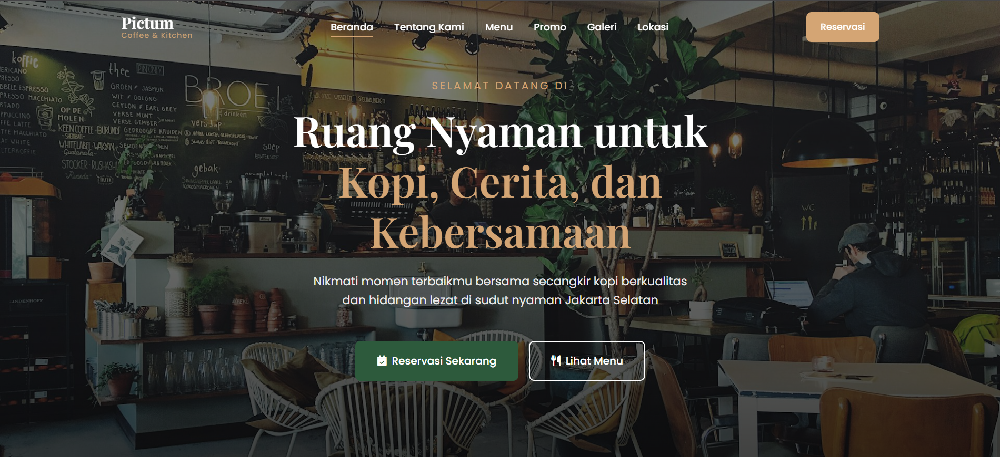
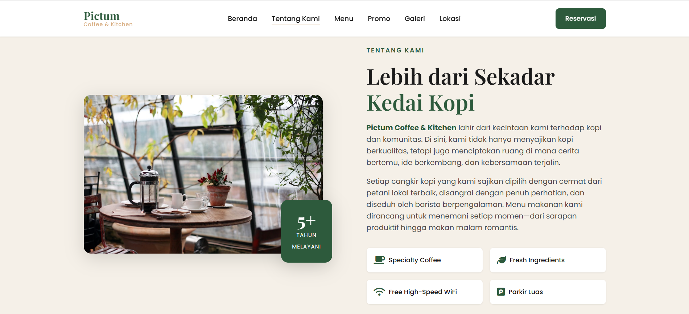
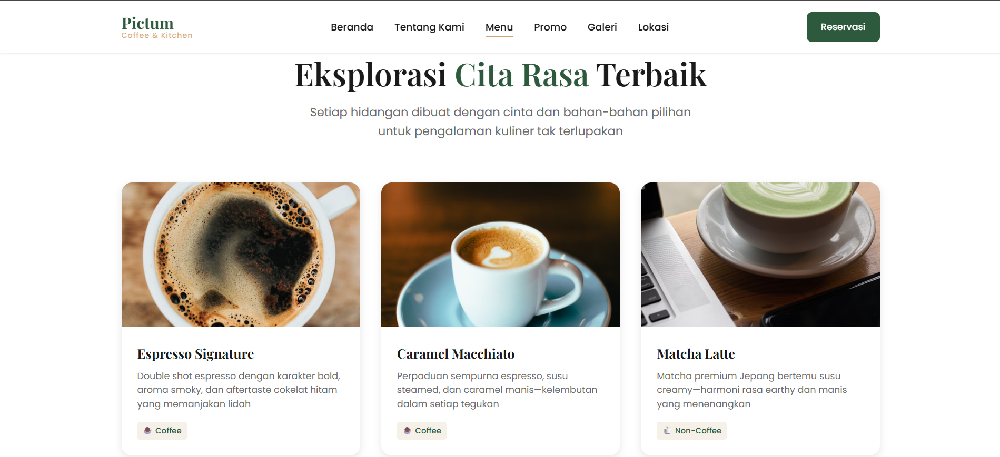
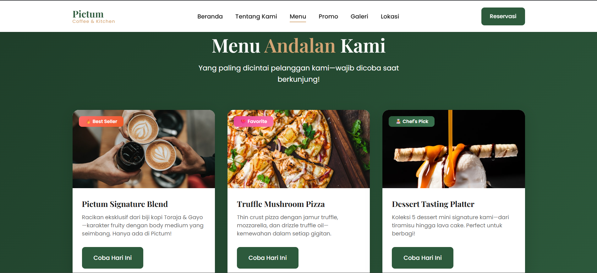
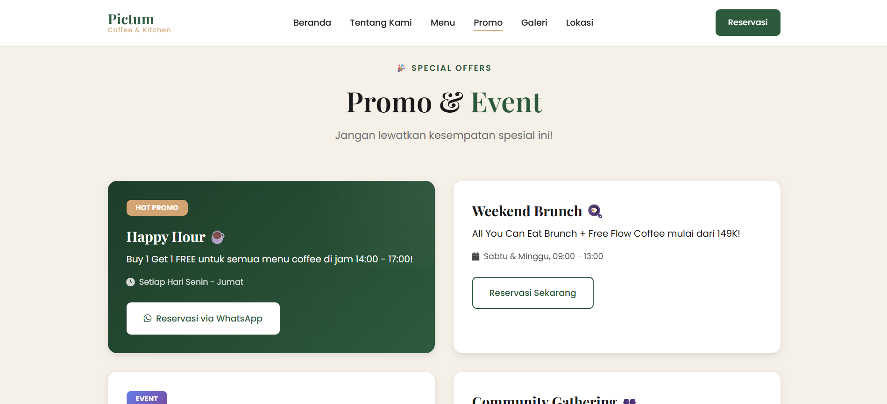
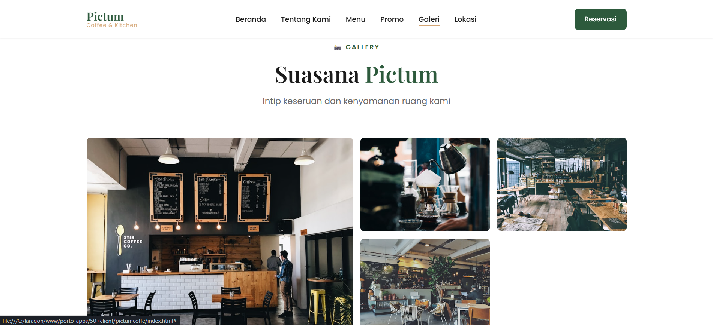
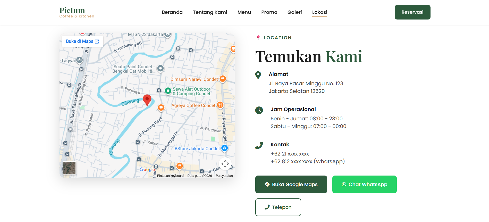

# Pictum Coffee & Kitchen - Landing Page


Website ini adalah **Landing Page / Company Profile** statis untuk **Pictum Coffee & Kitchen**, sebuah cafe dan restoran berkonsep modern yang berlokasi di Jakarta Selatan. Website ini dirancang untuk menampilkan informasi lengkap mengenai cafe, menu unggulan, fasilitas, promo, hingga melayani reservasi meja secara online yang terintegrasi langsung dengan WhatsApp.

## 📸 Tampilan Website (Screenshots)

### 1. Hero Section


### 2. About Section


### 3. Menu Section


### 4. Menu Andalan (Special)


### 5. Promo & Event


### 6. Galeri


### 7. Lokasi & Reservasi


## 🚀 Fitur Utama

- **Desain Modern & Responsif**: Tampilan yang menyesuaikan dengan baik di semua perangkat (Desktop, Tablet, Mobile).
- **Animasi Scroll (Reveal)**: Elemen-elemen muncul dengan animasi halus saat di-scroll ke bawah.
- **Hero Banner Interaktif**: Dilengkapi Call-to-Action (CTA) untuk melihat menu dan melakukan reservasi.
- **Katalog Menu Terorganisir**: Menampilkan menu mulai dari kopi, non-kopi, makanan utama (main course), hingga pastry dengan rapi.
- **Menu Andalan (Signature)**: Menyoroti menu _Best Seller_, _Favorite_, dan _Chef's Pick_.
- **Informasi Promo & Event**: Bagian khusus untuk menampilkan promo _Happy Hour_, _Weekend Brunch_, event _Live Music_, dan fasilitas _Community Gathering_.
- **Galeri Foto**: Penataan foto yang _aesthetic_ menampilkan interior, barista, hingga penyajian makanan.
- **Testimoni Pelanggan**: Integrasi Google Review mockup untuk membangun kepercayaan pengunjung.
- **Integrasi Lokasi Google Maps**: Peta petunjuk arah yang di-embed langsung, lengkap dengan informasi kontak detail.
- **Form Reservasi Terintegrasi WhatsApp**: Kolom interaktif untuk memesan tempat (nama, tanggal, waktu, jumlah orang) yang langsung diteruskan (di-_routing_) ke nomor WhatsApp admin saat di-submit.

## 🛠️ Teknologi yang Digunakan

Project ini murni dikembangkan sepenuhnya tanpa menggunakan external UI Framework (seperti Bootstrap atau TailwindCSS). Berikut adalah _tech-stack_ utamanya:

- **HTML5**: Struktur kerangka utama website dengan penulisan semantik.
- **CSS3 / Vanilla CSS**: Layouting (Grid & Flexbox), typography, pewarnaan (color scheme), animasi transisi, layout responsif (media queries), mode gelap-terang (opsional), dan efek glassmorphism/overlay.
- **Vanilla JavaScript (ES6)**: Scripting fungsi interaktif seperti:
  - Sticky Navigation Bar
  - Hamburger Menu (Mobile Toggle)
  - Animasi Reveal saat scroll (Intersection Observer)
  - Active Section Highlighting
  - Validasi dan format pengiriman form Reservasi ke WhatsApp API
- **Google Fonts**: Menggunakan font `Poppins` dan `Playfair Display`.
- **FontAwesome (v6)**: Digunakan untuk ikon-ikon esensial (seperti star rating, ikon medsos dan fasilitas).

## 📂 Struktur Folder

```text
pictumcoffe/
│
├── css/
│   └── styles.css          # Semua konfigurasi styling dan layout CSS
├── js/
│   └── main.js             # Script interaktivitas & logika validasi formulir
├── index.html              # Halaman HTML tunggal (Single Page Structure)
└── README.md               # Dokumentasi project ini
```

## ⚙️ Cara Instalasi & Menjalankan (Setup)

Karena project ini sepenuhnya statis (HTML, CSS, JS murni), tidak ada proses instalasi _package dependencies_ (seperti `npm install`) atau _build/compile_ yang dibutuhkan.

Anda dapat langsung menjalankannya dengan salah satu metode berikut:

### 1. Menggunakan Live Server (VS Code Extension) _[Rekomendasi]_

1. Buka folder instalasi menggunakan **Visual Studio Code**.
2. Pastikan ekstensi **Live Server** (oleh Ritwick Dey) sudah terinstall.
3. Klik kanan pada file `index.html`.
4. Pilih **"Open with Live Server"**. Browser akan terbuka ke `http://127.0.0.1:5500/index.html`.

### 2. Membuka Langsung via Browser

1. Buka folder instalasi/unduhan.
2. Klik ganda (double-click) pada file `index.html` dan otomatis terbuka di browser andalan Anda.

### 3. Web Server Lokal (XAMPP / Laragon / WAMP)

1. Pindahkan atau _clone_ folder project ini ke direktori root lokal server Anda (contoh di Laragon: `C:\laragon\www\pictumcoffe`).
2. Jalankan Apache dari panel kontrol (Laragon dsb.).
3. Buka browser dan arahkan ke alamat `http://pictumcoffe.test` atau `http://localhost/pictumcoffe`.

## ✏️ Cara Mengubah Konten Website

Berikut panduan singkat jika Anda ingin mengubah beberapa informasi kunci:

1. **Mengubah Nomor WhatsApp Tujuan (Reservasi & Kontak)**:

   - Akses `index.html`
   - Gunakan fitur pencarian (Ctrl+F) dan cari teks: `62812XXXXXXXX`
   - Ganti keseluruhan rentetan teks tersebut dengan format nomor WhatsApp bisnis Anda (misal `628123456789`). Jangan gunakan awalan angka `0`.
   - Lakukan hal yang sama pada file `js/main.js` apabila terdapat URL WhatsApp API yang tertaut di dalam script JS.

2. **Mengubah Daftar Menu**:

   - Cari bagian `<section class="menu section" id="menu">` di dalam `index.html`.
   - Modifikasi `<div class="menu-card">` untuk mengubah gambar (``), nama menu (`<h3>`), deskripsi (`<p>`), dan tag kategori (`<span>`).

3. **Mengubah Embed Google Maps**:
   - Cari bagian `<div class="location-map">`
   - Buka Google Maps, cari lokasi bisnis Anda, tekan **Bagikan** > **Sematkan Peta**.
   - Salin atribut `src="..."` dan tempelkan menimpa `src` iframe yang ada di dalam `index.html`.

## 📞 Pembuat / Kreator

Project ini dikelola dan dideploy oleh **Kevin Adisurya Nugraha**.

---

_Dibuat untuk tujuan profesional komersial - Pictum Coffee & Kitchen._
